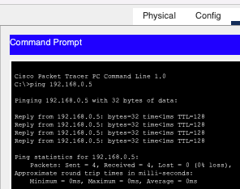
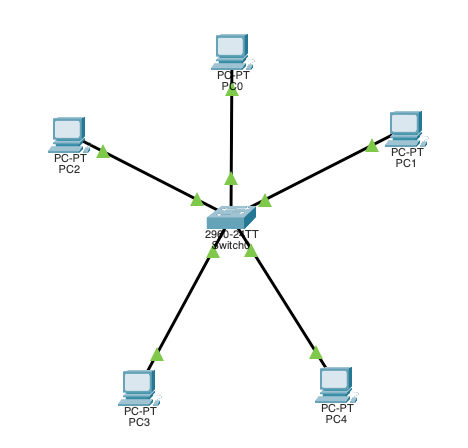
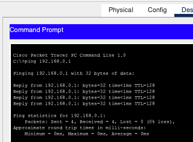
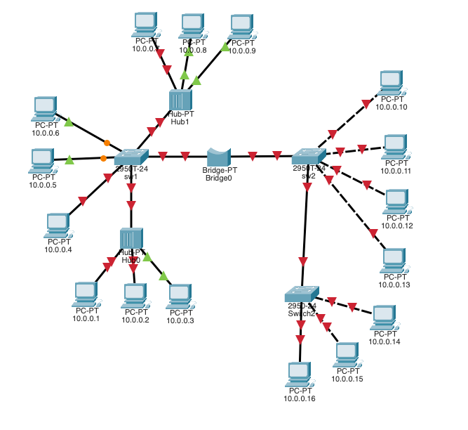
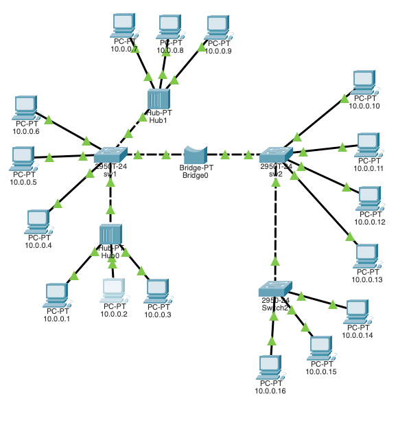
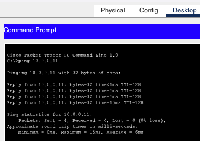
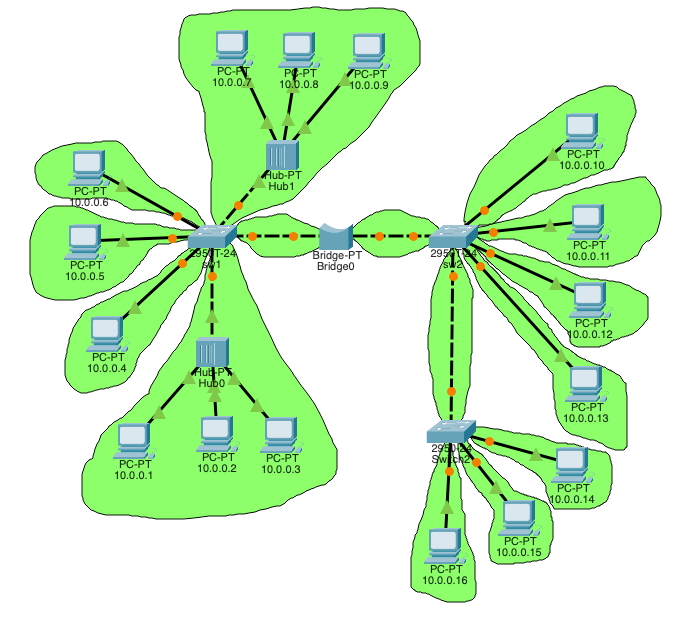

# Компьютерные сети. Лабораторная работа № 1

### [Руководство к ЛР](https://docs.google.com/document/d/1Z86DTMJc3F9BhJevMdyAwROGtaHFz3Pp/edit?usp=sharing&ouid=104050528212751164470&rtpof=true&sd=true)

## I. Топология "Общая шина" с поддержкой 6-ти хостов

Вид топологии:

[Файл lab1_bus.pkt](lab1_bus.pkt)

Команда ping работает корректно:

## II. Топология "Звезда" с поддержкой 5-ти хостов

Вид топологии:

[Файл lab1_star.pkt](lab1_star.pkt)

Команда ping работает корректно:

## III. Анализ состояния сети. Устранения базовых неисправностей

Исходный вид:

[Файл lab1.pkt](lab1.pkt)

### Дефекты

Вид после исправления дефектов:

[Файл lab1_fixed.pkt](lab1_fixed.pkt)

Команда ping работает корректно:

### Домены коллизий

[Файл lab1_fixed_domains.pkt](lab1_fixed_domains.pkt)
