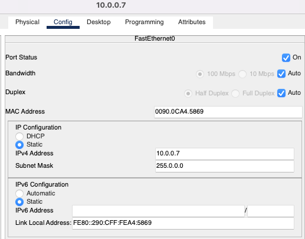
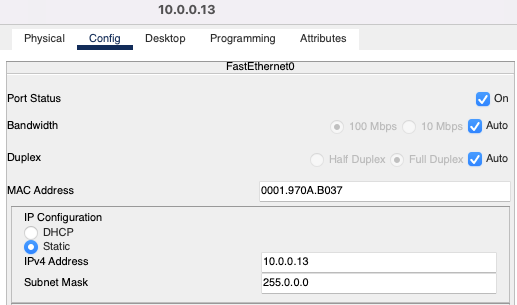

# Компьютерные сети. Лабораторная работа № 1

### [Руководство к ЛР](https://docs.google.com/document/d/1Z86DTMJc3F9BhJevMdyAwROGtaHFz3Pp/edit?usp=sharing&ouid=104050528212751164470&rtpof=true&sd=true)

## I. Топология "Общая шина" с поддержкой 6-ти хостов

Вид топологии:

[Файл lab1_bus.pkt](lab1_bus.pkt)

Команда ping работает корректно:

## II. Топология "Звезда" с поддержкой 5-ти хостов

Вид топологии:

[Файл lab1_star.pkt](lab1_star.pkt)

Команда ping работает корректно:

## III. Анализ состояния сети. Устранения базовых неисправностей

Исходный вид:

[Файл lab1.pkt](lab1.pkt)

### Исправление дефектов

1. Исправления для `PC` с именем `10.0.0.7`:

> Добавлен `IPv4 Address` и `Port Status` переведён в режим `On` 

2. Между хабом `Hub1` и свитчем `sw1` заменён медный кабель на кроссовер.

3. Исправления для `PC` с именем `10.0.0.4`:

> Изменён `IPv4 Address`, а `Bandwidth` и `Duplex` переведены в режим `Auto` 

4. Между хабом `Hub0` и свитчем `sw1` заменён медный кабель на кроссовер.

5. Исправления для `PC` с именем `10.0.0.1`:

> Добавлен `IPv4 Address` и `Port Status` переведён в режим `On` 

6. Исправления для `PC` с именем `10.0.0.2`:

> `Port Status` переведён в режим `On` 

7. Между свитчем `sw1` и `Bridge0` заменён медный кабель на кроссовер.
8. Между свитчем `sw2` и `Bridge0` заменён медный кабель на кроссовер.
9. Исправления для свитча `sw2`:
> В интерфейсах `Port Status` переведён в режим `On` и `Duplex` переведены в режим `Auto` 

10. Исправления для свитча `Switch2`:
> В интерфейсах `Port Status` переведён в режим `On` 

11. Между свитчем `sw2` и `Switch2` заменён медный кабель на кроссовер.

12. Исправления для `PC` с именем `10.0.0.16`:

> Добавлен `IPv4 Address` и `Port Status` переведён в режим `On`

13. Исправления для `PC` с именем `10.0.0.15`:

> Добавлен `IPv4 Address` и `Port Status` переведён в режим `On` а также заменён кабель на медный

14. Исправления для `PC` с именем `10.0.0.14`:

> Добавлен `IPv4 Address` и `Port Status` переведён в режим `On` а также заменён кабель на медный

15. Исправления для `PC` с именем `10.0.0.10`:

> Изменён `IPv4 Address` и `Bandwidth` переведён в режим `Auto` а также заменён кабель на медный

16. Исправления для `PC` с именем `10.0.0.11`:

> Заменён кабель на медный

17. Исправления для `PC` с именем `10.0.0.12`:

> Заменён кабель на медный и `Port Status` переведён в режим `On`

18. Исправления для `PC` с именем `10.0.0.13`:

> Добавлен `IPv4 Address` и `Port Status` переведён в режим `On` а также заменён кабель на медный

Вид после исправления дефектов:

[Файл lab1_fixed.pkt](lab1_fixed.pkt)

Команда ping работает корректно:

### Домены коллизий

[Файл lab1_fixed_domains.pkt](lab1_fixed_domains.pkt)
