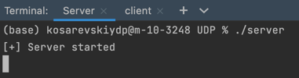
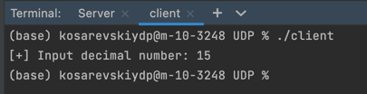
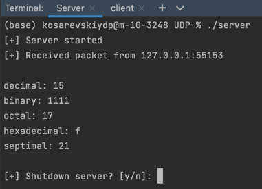

# Компьютерные сети. Лабораторная работа № 2

### [Руководство к ЛР](https://networking-labs.ru/mod/assign/view.php?id=228)

## Часть I.

Создать клиент-серверное приложение на основе сетевых (системных) сокетов, транспортный протокол **UDP**. Использовать язык С./ C++

1. Клиент должен передавать серверу десятичное число (вводится с клавиатуры).
2. На сервере число выводится в десятичной, двоичной, шестнадцатеричной, восьмеричной системах счисления + системе счисления с основанием номер студента по списку. (При совпадении с имеющейся прибавить 1).

Сервер и клиент должны корректно обрабатывать начало и конец соединения.

### Выполнение программы
Компиляция
```bash
gcc server.c -o server
gcc client.c -o client
```

Запуск
```bash
./server 4455
./client 4455
```

Запуск сервера: 



Запуск клиента и ввод числа:



Результат вычислений на сервере:



## Часть II.

1. Создать клиент-серверное приложение на основе сетевых (системных) сокетов, транспортный протокол **TCP**. Использовать язык С./ C++
2. Клиент должен передать серверу имя файла в виде строки (вводится на стороне клиента с клавиатуры). Сервер должен передать файл с указанным именем клиенту (если в папке с сервером присутствует такой файл). 
3. Сервер должен вести лог, в который заносится каждый переданный файл и время передачи (через пробел).
