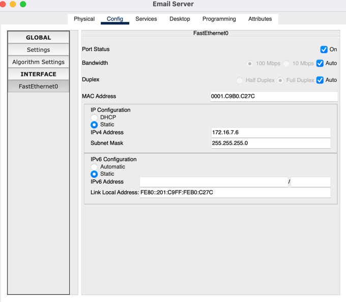
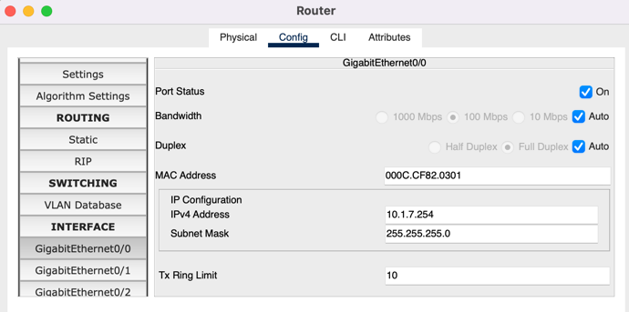

# Компьютерные сети. Лабораторная работа № 4 (вариант 7)

## Настройка сетевых служб: DNS, HTTP, электронной почты в сетевом симуляторе

### [Руководство к ЛР](https://docs.google.com/document/d/1Y3VU0xgl8_Ie_3lzDZ1uW_Du-xWUnRWR/edit?usp=sharing&ouid=104050528212751164470&rtpof=true&sd=true)

1) Присвоить портам устройств статические ipv4 адреса в соответствии с вариантом

PC0:

PC1:

PC2:

DNS server:

HTTP server:

Email server:

2) Настроить безопасный доступ к коммутаторам и маршрутизатору

3) Указать адреса портов маршрутизатора как адрес шлюза по умолчанию для конечных узлов

PC0:

PC1:

PC2:

DNS server:

HTTP server:

Email server:

4) Настроить DNS сервер

5) Указать адрес DNS сервера для конечных узлов

DNS сервер указан для конечных узлов, как видно из предыдущих скриншотов.

6) Настроить почтовый сервер SMTP и POP3

7) Добавить почтовые записи на DNS - сервер

8) Настроить почтовый клиент на всех ПК

9) Настроить HTTP сервер, разместить там тестовую страницу с номером варианта, фамилией, номером группы, датой
   выполнения работы.

10) Проверить корректное прохождение сигнала между всеми узлами сети, доступность 
    настроенных сервисов со стороны клиентов на ПК

ping между PC2 и DNS server:

ping между PC1 и Email server:

ping между PC1 и HTTP server:

проверка доставки постовых сообщений:

11) Отметить широковещательные домены и домены коллизий на схеме

Адрес ПК (сеть 1): 10.1.x.y 255.255.255.0 \
Адрес DNS сервера (сеть 2): 192.168.x.y 255.255.255.0 \
Адрес HTTP и SMTP серверов (сеть 3): 172.16.x.y 255.255.255.0

> x - Ваш номер по списку в Электронном Университете, y - порядковый номер от 1 и выше
