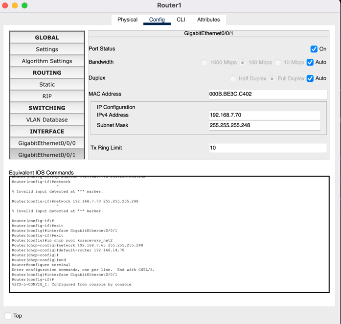

# Компьютерные сети. Лабораторная работа № 6 (вариант 7)

### Разбиение сети на подсети. Настройка DHCP-сервера в сетевом эмуляторе[^1]

**Задачи**

Для локальной общей сети был выделен частный адрес 192.168.x.0/24

[I. Разделить сеть на 5 подсетей](#task1)

1) Подсети 1 и 5 должны поддерживать до x + 10 устройств
2) Подсети 2 и 4 должны поддерживать до 5 устройств
3) Подсеть 3 должна поддерживать только 2 устройства

> Где x - Ваш номер по списку в ЭУ \
> Использовать не более трех подсетей с возможностью размещения x + 10 хостов

[II. Настроить DHCP-сервера для выдачи адресов](#task2)

1) Для подсети 1 настроить отдельный DHCP сервер
2) Для подсети 2 настроить в качестве DHCP-сервера маршрутизатор 1
3) Для подсетей 4 и 5 настроить в качестве DHCP-сервера маршрутизатор 2

## task1

### Разбиение сети на подсети

Адрес 192.168.7.0 => 1100 0000.1010 1000.0000 0111.0000 0000 \
Маска 24 => 1111 1111.1111 1111.1111 1111.0000 0000

| Номер подсети     | Требуемый размер    | Выделенно адресов    | Остаток свободных адресов    | IP адрес подсети    |  Маска подсети    | Префикс маски    |       Диапазон адресов        | Широковещание    |
|:---------------:|:----------------:	|:-----------------:	|:-------------------------:	|:----------------:	|:---------------:	|:-------------:	|:---------------------------:	|:-------------:	|
|    1            |       17+2        |         32            |             13                | 192.168.7.0        | 255.255.255.224    |      /27        | 192.168.7.1 - 192.168.7.30    | 192.168.7.31    |
|    5            |       17+2        |         32            |             13                | 192.168.7.32        | 255.255.255.224    |      /27        | 192.168.7.33 - 192.168.7.62    | 192.168.7.63    |
|    2            |        5+2        |         8            |             1                | 192.168.7.64        | 255.255.255.248    |      /29        | 192.168.7.65 - 192.168.7.70    | 192.168.7.71    |
|    4            |        5+2        |         8            |             1                | 192.168.7.72        | 255.255.255.248    |      /29        | 192.168.7.73 - 192.168.7.78    | 192.168.7.79    |
|    3            |        2+2        |         4            |             0                | 192.168.7.80        | 255.255.255.252    |      /30        | 192.168.7.81 - 192.168.7.82    | 192.168.7.83    |

**Адрес подсети 1:** <b style='color:blue'>1100 0000.1010 1000.0000 0111.000</b> | <b style='color:red'>00000</b> \
**Адрес подсети 5:** <b style='color:blue'>1100 0000.1010 1000.0000 0111.001</b> | <b style='color:red'>00000</b> \
**Маска:** <b style='color:blue'>1111 1111.1111 1111.1111 1111.111</b> | <b style='color:red'>0 0000</b> или /27

**Адрес подсети 2:** <b style='color:blue'>1100 0000.1010 1000.0000 0111.01000</b> | <b style='color:red'>000</b> \
**Адрес подсети 4:** <b style='color:blue'>1100 0000.1010 1000.0000 0111.01001</b> | <b style='color:red'>000</b> \
**Маска:** <b style='color:blue'>1111 1111.1111 1111.1111 1111.1111 1</b> | <b style='color:red'>000</b> или /29

**Адрес подсети 3:** <b style='color:blue'>1100 0000.1010 1000.0000 0111.010100</b> | <b style='color:red'>00</b> \
**Маска:** <b style='color:blue'>1111 1111.1111 1111.1111 1111.1111 11</b> | <b style='color:red'>00</b> или /30

## task2

### Настройка DHCP-серверов

1) Настройка отдельного DHCP сервера для подсети 1: 

2) Настройка в качестве DHCP-сервера маршрутизатора 1 для подсети 2:

Настройка маршрутизатора:

Настройка трёх серверов:

Проверка существования адресов, выданных DHCP сервером:

4) Настройка в качестве DHCP-сервера маршрутизатора 2 для подсетей 4 и 5:

Настройка связующей подсети 3:

Настройка подсети 4:

Настройка подсети 5:

Результат настройки:

Вид сети после окончательной настройки:

[^1]: [Руководство к ЛР](https://docs.google.com/document/d/1vEfhfzuDD6SAu-zStUmlOFL9MCtMWUaR/edit?usp=sharing&ouid=104050528212751164470&rtpof=true&sd=true)
