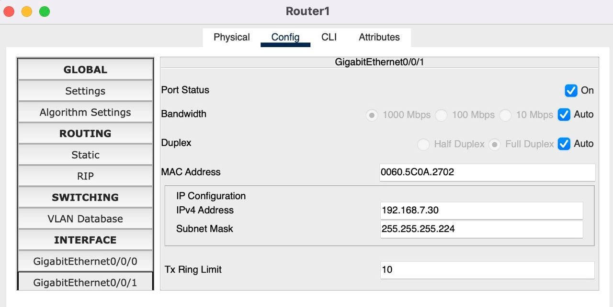
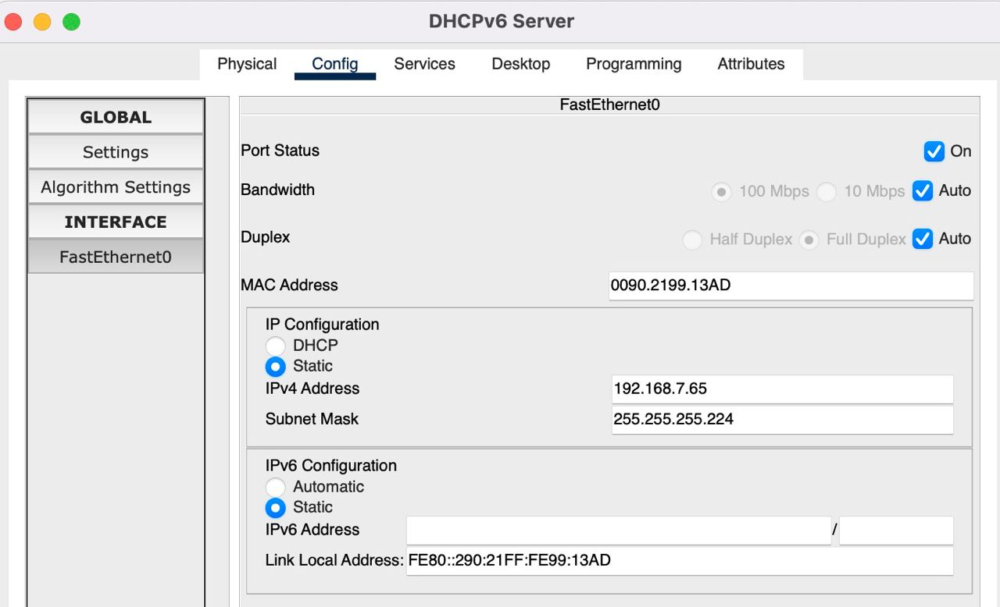

# Компьютерные сети. Лабораторная работа № 7 (вариант 7)

### Изучение статической маршрутизации для сетей с поддержкой IPv4 и IPv6 в сетевом симуляторе[^1]

**Задачи**

[I. Разделить сеть на подсети](#task1)

Разделить сеть на подсети в соответствии с системой адресации IPv4. Выделить достаточно адресов для размещения x+20
хостов в подсетях 1 и 2, x+10 в подсети 3, по 2 адреса интерфейса на соединения “точка-точка” между маршрутизаторами 
> Где x - Ваш номер по списку в ЭУ

[II. Настроить статическую маршрутизацию](#task2)

Настроить статическую маршрутизацию так, чтобы пинг любым хостом или маршрутизатором любого другого хоста или
маршрутизатора был успешным.

[III. Выделить маршрутизаторам IPv6 адреса](#task3)

Выделить маршрутизаторам IPv6 адреса формата 2001:x+y::z/64
> где x - Ваш номер по списку в ЭУ, y - порядковый номер подсети, z - порядковый номер интерфейса

[IV. Установить автоконфигурирование IPv6](#task4)

Установить автоконфигурирование IPv6 без отслеживания состояния (SLAAC) для интерфейсов хостов в подсетях 1 и 2. В
подсети 3 использовать SLAAC +DHCPv6.

[V. Настроить статическую маршрутизацию с IPv6](#task5)

Настроить статическую маршрутизацию так, чтобы пинг любым хостом или маршрутизатором любого другого хоста или
маршрутизатора с использованием IPv6 адреса был успешным

## task1

### Разбиение сети на подсети

Адрес 192.168.7.0 => 1100 0000.1010 1000.0000 0111.0000 0000 \
Маска 24 => 1111 1111.1111 1111.1111 1111.0000 0000

| Номер подсети 	| Требуемый размер 	| Выделено адресов 	| Остаток свободных адресов 	| IP адрес подсети 	|  Маска подсети  	| Префикс маски 	|        Диапазон адресов       	| Широковещание 	|
|:-------------:	|:----------------:	|:----------------:	|:-------------------------:	|:----------------:	|:---------------:	|:-------------:	|:-----------------------------:	|:-------------:	|
|       1       	|       27+2       	|        32        	|             3             	| 192.168.7.0      	| 255.255.255.224 	|      /27      	| 192.168.7.1 - 192.168.7.30    	| 192.168.7.31  	|
|       2       	|       27+2       	|        32        	|             3             	| 192.168.7.32     	| 255.255.255.224 	|      /27      	| 192.168.7.33 - 192.168.7.62   	| 192.168.7.63  	|
|       3       	|       17+2       	|        32        	|             13            	| 192.168.7.64     	| 255.255.255.224 	|      /27      	| 192.168.7.65 - 192.168.7.94   	| 192.168.7.95  	|
|       4       	|        2+2       	|         4        	|             0             	| 192.168.7.96     	| 255.255.255.252 	|      /30      	| 192.168.7.97 - 192.168.7.98   	| 192.168.7.99  	|
|       5       	|        2+2       	|         4        	|             0             	| 192.168.7.100    	| 255.255.255.252 	|      /30      	| 192.168.7.101 - 192.168.7.102 	| 192.168.7.103 	|
|       6       	|        2+2       	|         4        	|             0             	| 192.168.7.104    	| 255.255.255.252 	|      /30      	| 192.168.7.105 - 192.168.7.106 	| 192.168.7.107 	|

## task2

### Настройка статической маршрутизации

## task3

### Выделить IPv6 адресов

## task4

### Установка автоконфигурирования IPv6

## task5

### Настройка статической маршрутизации с IPv6

---

[^1]: [Руководство к ЛР](https://docs.google.com/document/d/1wRfKAdGy0C9IdeI3la3SN53uCnMJWr9l/edit?usp=sharing&ouid=104050528212751164470&rtpof=true&sd=true)
