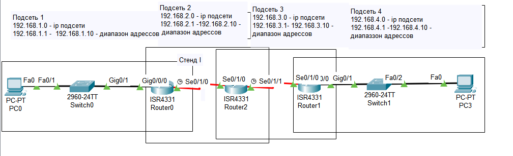
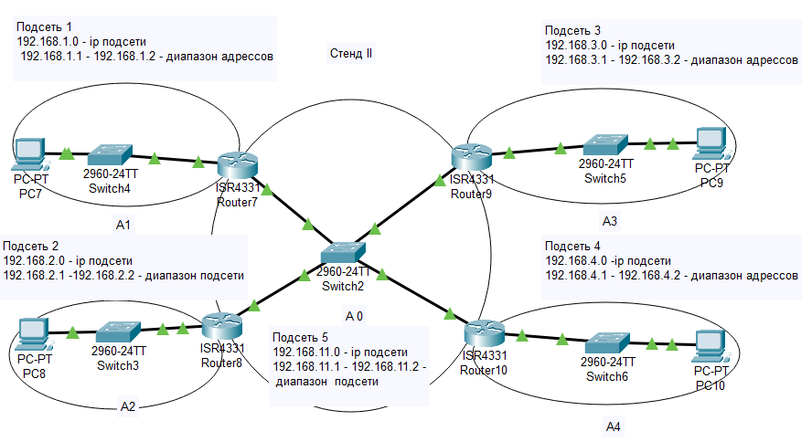
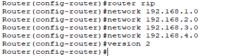
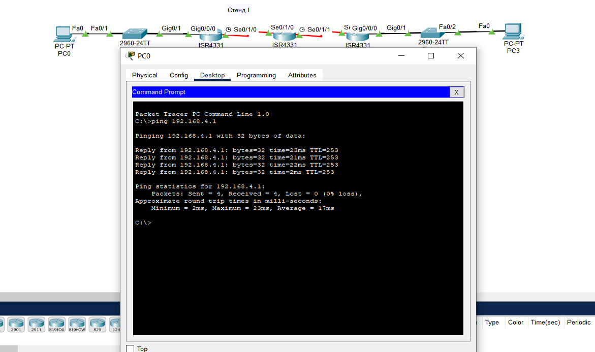
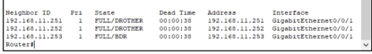
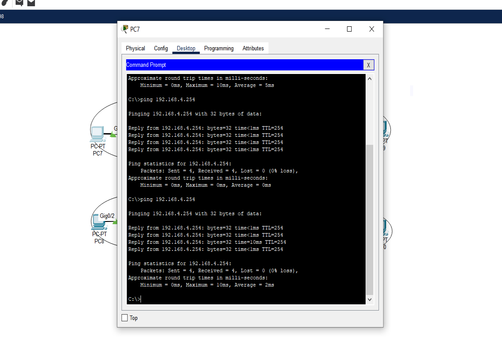

# Компьютерные сети. Лабораторная работа № 7 (вариант 7)

### Изучение статической маршрутизации для сетей с поддержкой IPv4 и IPv6 в сетевом симуляторе[^1]

**Задачи**

[I. Назначить адреса подсетей](#task1)

- Подсеть 1: 192.168.x.0 /24
- Подсеть 2: 192.168.x+1.0 /24
- Подсеть 3: 192.168.x+2.0 /24
- Подсеть 4: 192.168.x+3.0 /24
- Подсеть 5 (В задаче III): 192.168.x+10.0 /24

[II. Настроить динамическую маршрутизацию](#task2)

В прилагаемом `.pkt` файле на стенде I через протокол `RIPv2` так, чтобы пинг любым хостом или маршрутизатором любого
другого хоста или маршрутизатора был успешным. 
Представить отдельным `.pkt` файлом.

[III. Настроить динамическую маршрутизацию в сети](#task3)

В прилагаемом `.pkt` файле на стенде II через протокол `OSPF` так, чтобы пинг любым хостом или маршрутизатором любого
другого хоста или маршрутизатора был успешным. Разделить при этом сеть на области `OSPF` в соответствии со схемой.
Выполнить указания в лабораторной работе.
Представить отдельным `.pkt` файлом. 

## task1

### Назначить адреса подсетей

На стенде I подсети выделены слева направо по порядку номеров. На рисунке показано разделение на
подсети с выписанным диапазоном адресов:

На следующем рисунке приведено разделение сети на подсети на стенде II с 
указанным диапазоном адресов: 

## task2

### Настроить динамическую маршрутизацию

Для корректной работы динамической маршрутизации необходимо настроить все роутеры для использования `RIPv2`. На
рисунке приведены список команд, используемые для каждого роутера (на примере роутера `Router0` – для остальных роутеров
сделано по аналогии).

Далее было проведено тестирование – компьютером `PC0` пинг компьютера `PC3`.

## task3

### Настроить динамическую маршрутизацию в сети

Для настройки динамической маршрутизации через протокол `OSPF` для всех роутеров была проведена настройка.
Вывод информации о статусе соседних устройств для `Router7`:

Пинг `PC10` из `PC7`:

---

[^1]: [Руководство к ЛР](https://docs.google.com/document/d/1wRfKAdGy0C9IdeI3la3SN53uCnMJWr9l/edit?usp=sharing&ouid=104050528212751164470&rtpof=true&sd=true)
