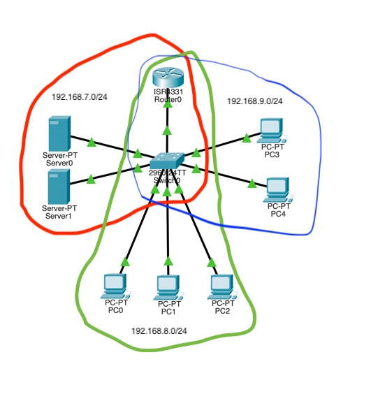
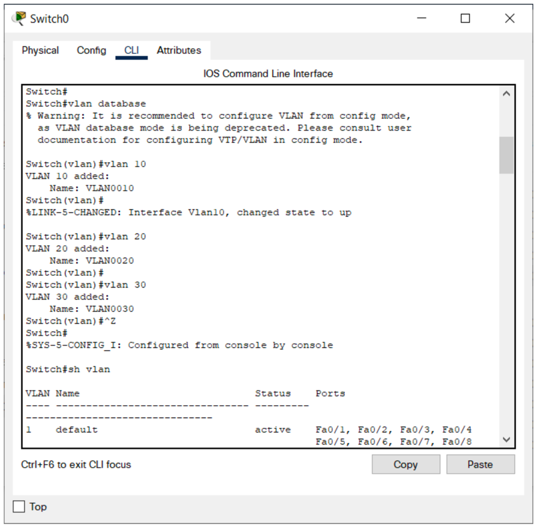
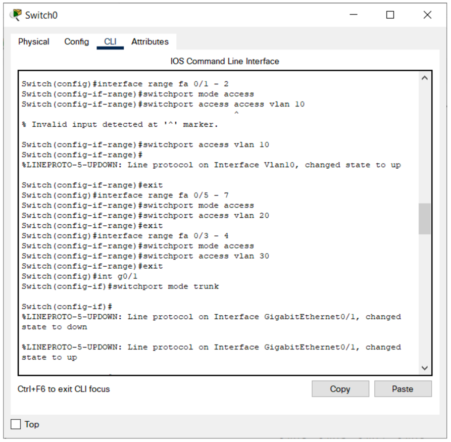
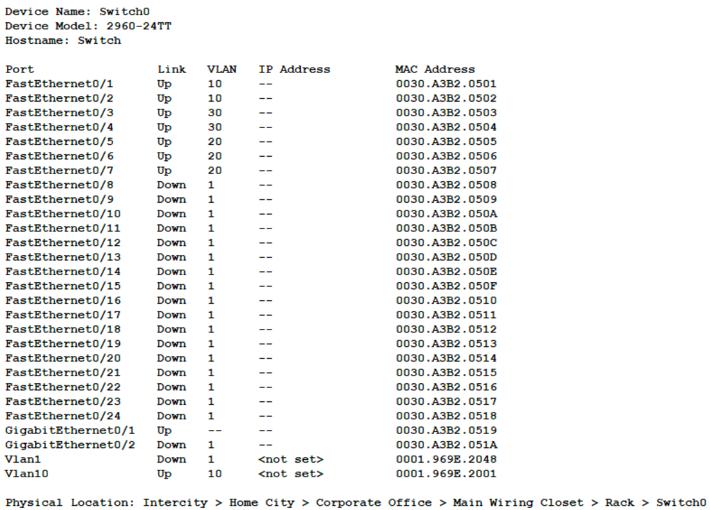
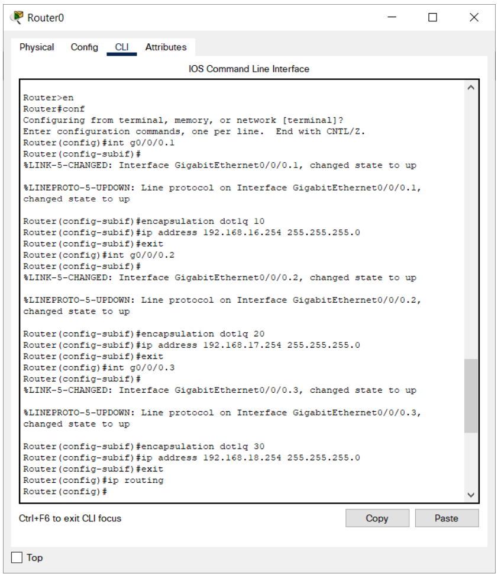
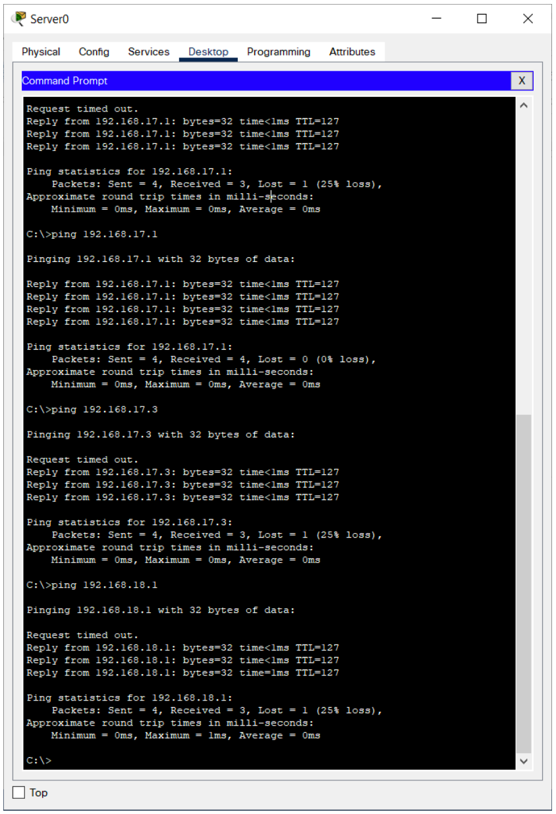
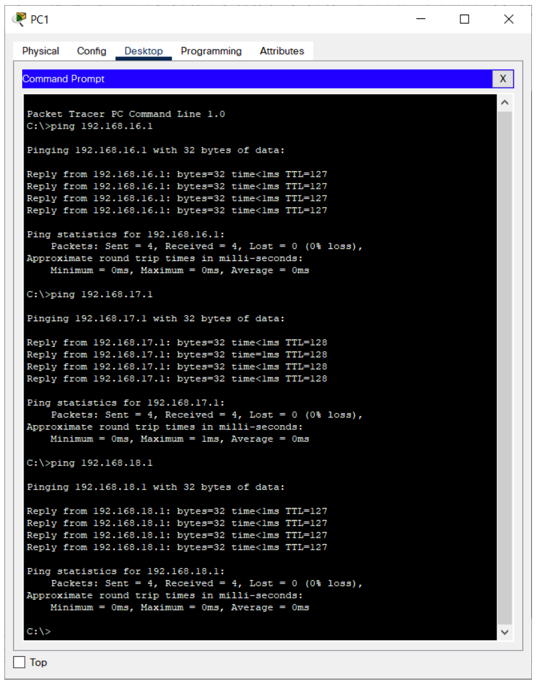
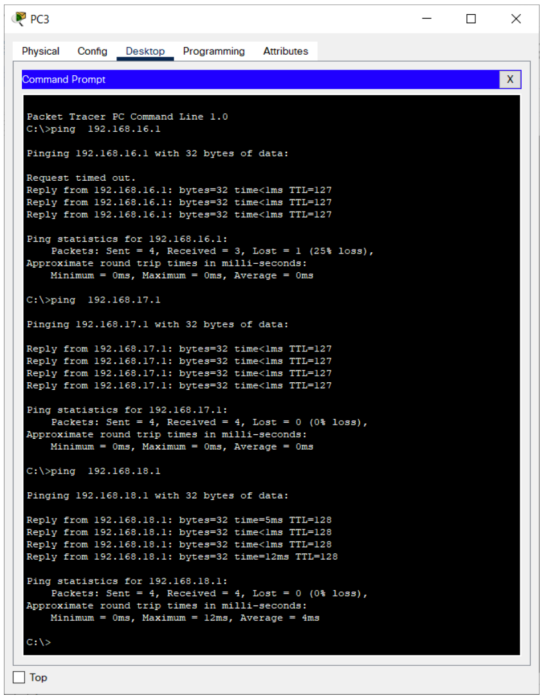

# Компьютерные сети. Лабораторная работа № 9

### Изучение технологии виртуальных локальных сетей (VLan) в сетевом симуляторе. Настройка маршрутизации между VLan.[^1]

**Задачи**

[I. Назначить адреса подсетей.](#task1)

- Подсеть 1: 192.168.x.0 /24
- Подсеть 2: 192.168.x+1.0 /24
- Подсеть 3: 192.168.x+2.0 /24

[II. Настроить поддержку трех виртуальных локальных сетей (VLan 10, 20, 30) на коммутаторе.](#task2)

[III. Настроить маршрутизацию между виртуальными локальными сетями на маршрутизаторе.](#task3)

[IV. Выделить и озаглавить на схеме каждую виртуальную локальную сеть.](#task4)

## task1

### Назначить адреса подсетей.

## task2

### Настроить поддержку трех виртуальных локальных сетей (VLan 10, 20, 30) на коммутаторе.

## task3

### Настроить маршрутизацию между виртуальными локальными сетями на маршрутизаторе.

## task4

### Выделить и озаглавить на схеме каждую виртуальную локальную сеть.

---

[^1]: [Руководство к ЛР](https://docs.google.com/document/d/14n5vbkZ-4jv9xd9lmeH_5Ax81pG-f2Zv/edit?usp=sharing&ouid=104050528212751164470&rtpof=true&sd=true)
